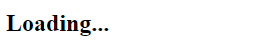
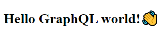

# GraphQL Hello World👋 Server 
A simple graphql client-server project to understand how graphql works


## Install this project

Clone the project, move to the **server** folder and install the dependencies.

```bash
git clone https://github.com/reymon359/graphql-hello-world-server
cd graphql-hello-world-server/server
npm install
```

## Run the project

In the server folder run the GraphQL server with the command:

```bash
node server.js
```

Then open the **index.html** file from the **client** folder in your browser to see the data fetched.
At first you will see a **Loading...** title like this one:



And when the data is fetched it will change to **Hello GraphQL world!👋**




